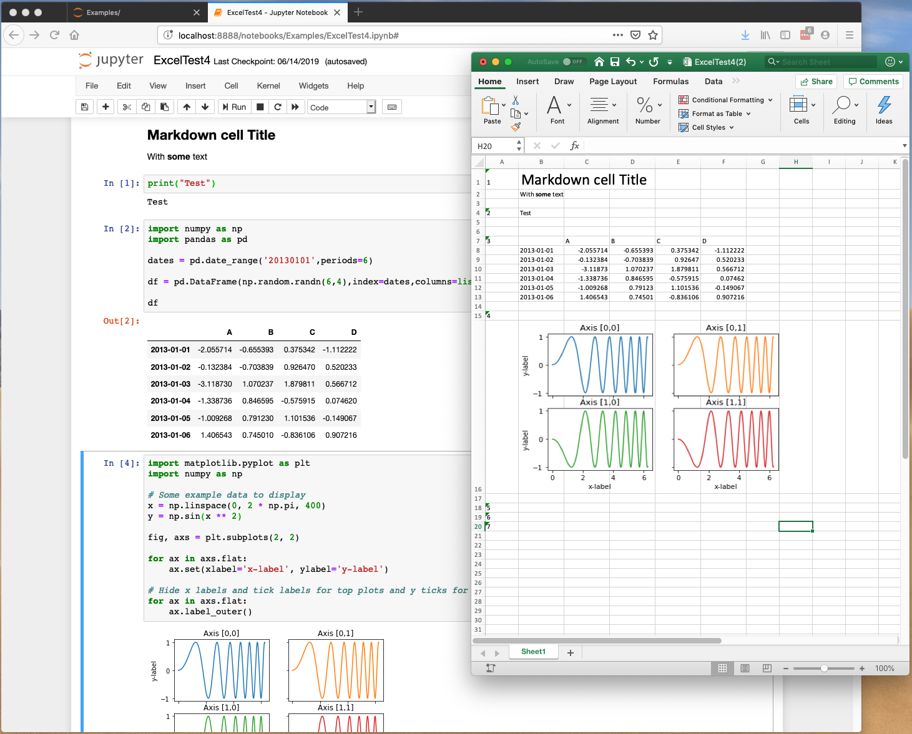

# nb2xls - Jupyter notebooks to Excel Spreadsheets

Convert Jupyter notebooks to Excel Spreadsheets (xlsx), through a new 'Download As' option or via nbconvert on the 
command line.

Respects tables such as Pandas DataFrames. Also exports image data such as matplotlib output.

Markdown is supported where possible (some elements still need work). 

Input (code) cells are not included in the spreadsheet.

This allows you to share your results with non-programmers such that they can still easily play with the data.



Please note this is an ALPHA version. Some notebook features may be lost. Please send example ipynb files to me along with 
reports of any problems.

Try it out online through Binder:

[](https://mybinder.org/v2/gh/ideonate/nb2xls/master)

## Installation

Install via pip (recommended)

```
pip install nb2xls
```

Restart Jupyter to pick up the new 'Excel Spreadsheet (.xlsx)' option under 'Download As' in the File menu.

## Usage

In Jupyter Notebook, just select the 'Excel Spreadsheet (.xlsx)' option under 'Download As' in the File menu.

To run from the command line try:

```
jupyter nbconvert --to xls Examples/ExcelTest.ipynb
```

or

```
jupyter nbconvert --to nb2xls.XLSExporter Examples/ExcelTest.ipynb
```

This should output ExcelTest.xlsx in the same folder as the ipynb file specified.

## Development Installation

If you want to contribute or debug:

```
git clone https://github.com/ideonate/nb2xls
cd nb2xls
pip install -e .
```

To run tests, you will need to install some extra dependencies. Run:
 ```
pip install -e .[test]
```

Then run:
```
pytest
```

## Requirements

nb2xls requires Python 3 and is tested against recent versions of jupyter and nbconvert. Please let me know if you 
find incompatibilities   

## Contact for Feedback

Please get in touch with any feedback or questions: [dan@ideonate.com](dan@ideonate.com). It is very helpful to send 
example notebooks, especially if you have bug reports or feature suggestions.

## License

This code is released under an MIT license.

## Change Log

0.1.6 (5 Aug 2019)
- Better layout and formatting of Pandas tables

0.1.5 (1 Aug 2019)
- Displays multiple outputs in display_data and execute_data output types

0.1.4 (26 Jul 2019)
- Better handling of mimetypes application/json and text/markdown
 
0.1.3 (24 Jul 2019)
- Working with Pandas/NumPy NaN values

0.1.2 (11 Jul 2019)
- Minor changes, mainly to deployment mechanism

0.1.1 (10 Jul 2019)
- Displays images over multiple rows for better scrolling
- Better markdown parsing especially for nested lists
  
0.0.1 (14 Jun 2019)
- Initial release
